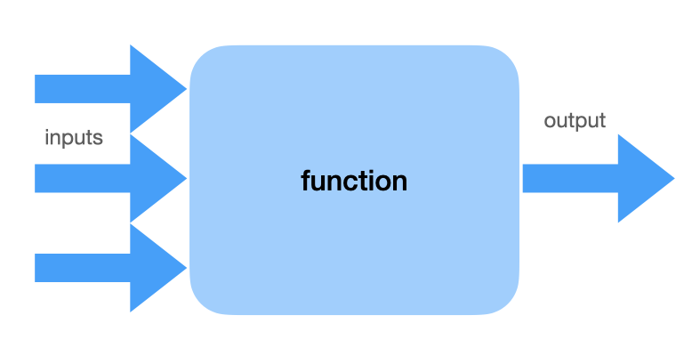
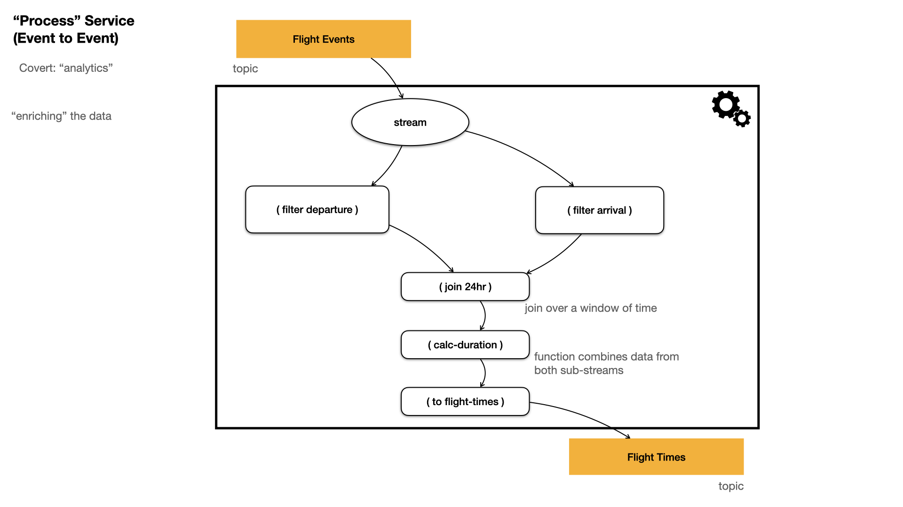
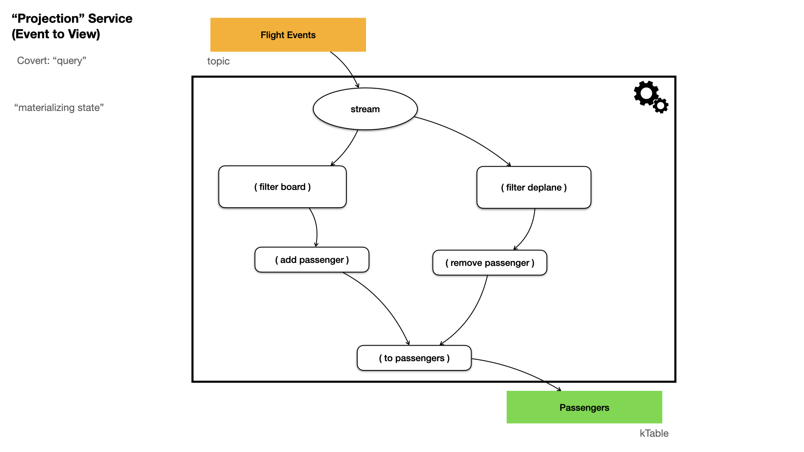
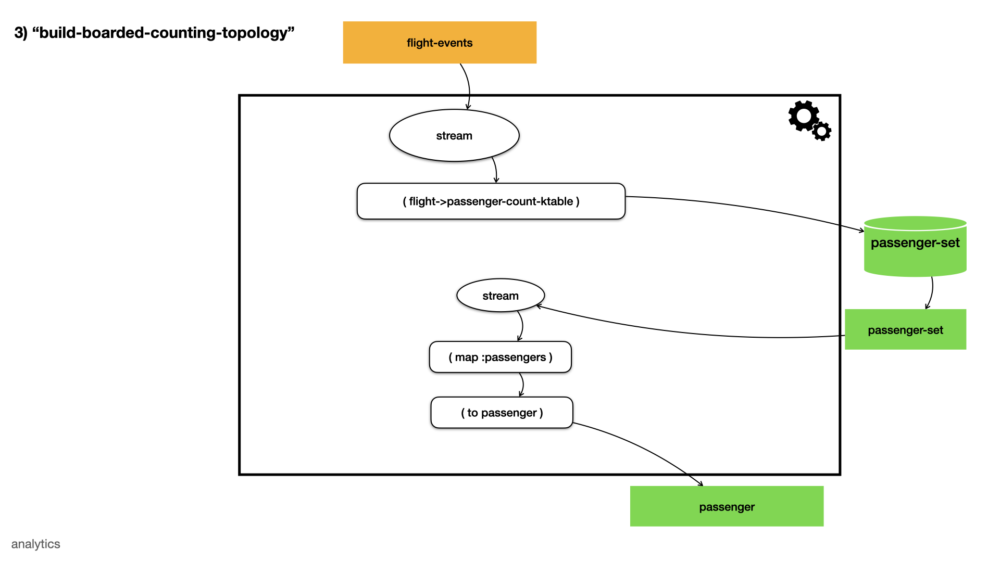
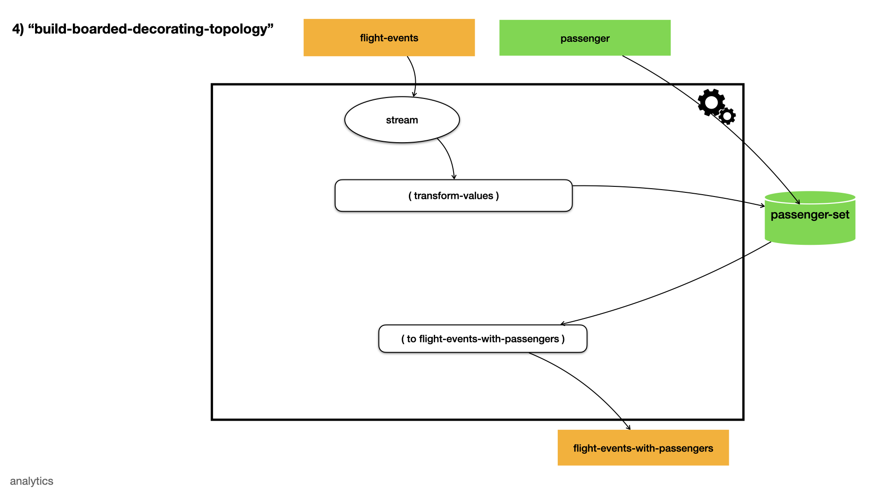
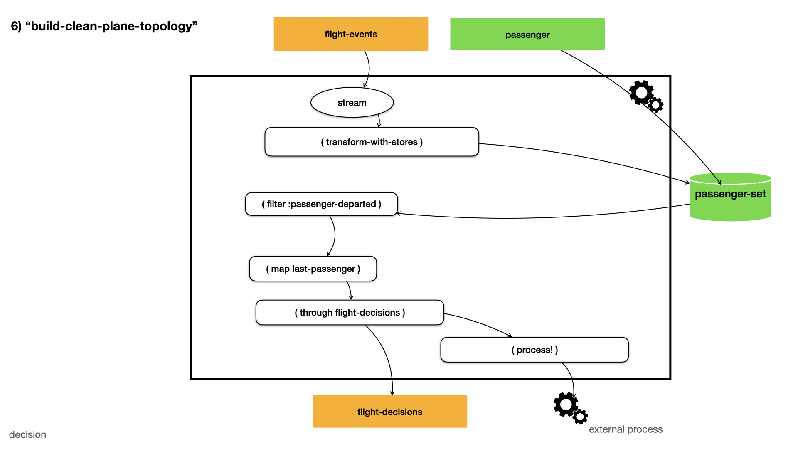

<!-- START doctoc generated TOC please keep comment here to allow auto update -->
<!-- DON'T EDIT THIS SECTION, INSTEAD RE-RUN doctoc TO UPDATE -->
**Table of Contents**  *generated with [DocToc](https://github.com/thlorenz/doctoc)*

- [All the World's a DAG](#all-the-worlds-a-dag)
  - [Functions](#functions)
  - [Kafka Topology](#kafka-topology)
  - [Re-frame](#re-frame)
  - [React/Reagent](#reactreagent)
  - [Widgets and UI Composition](#widgets-and-ui-composition)
  - [Microservices](#microservices)
  - [System Composition](#system-composition)

<!-- END doctoc generated TOC please keep comment here to allow auto update -->

# All the World's a DAG

**DAG** _Directed Acyclic Graph_

a [directed acyclic graph](https://en.wikipedia.org/wiki/Directed_acyclic_graph) is a graph of nodes and 
edges where the edges have a notion of direction (from/to) and
the overall graph contains no "cycles" (any path which visits one or more nodes multiple times) 

Over the years we have realized that our entire approach to system and software develop can be modeled by DAGs,
from the smallest functions all the way up to the entire system itself.

Working to implement as much of the design and implementation as DAGs gives us tremendous power. Specifically, we
can use a large number of mathematical operators (see [Wikipedia](https://en.wikipedia.org/wiki/Directed_acyclic_graph)).
Additionally, there are many tools we can use to visualize or even construct DAGs. This gives us the ability to 
develop tools for developers, and even end-user, to compose [processing pipelines](#kafka-topology), [UI widgets](#widgets-and-ui-composition),
and even [entire systems](#system-composition).

See also [Loom](https://github.com/aysylu/loom) and [Onyx](http://www.onyxplatform.org).

## Functions

We program in Clojure, a functional programming language. As such, functions themselves (the "pure" functions
anyway) exhibit this one-way directional flow:

Figure 1: Functions take inputs and produce an output.

Clojure even has idiomatic notation (`->`, `->>`, `as->`, etc.) that make this notion explicit in the source code itself.

## Kafka Topology

A [Kafka topology](https://jaceklaskowski.gitbooks.io/mastering-kafka-streams/content/kafka-streams-Topology.html) as a 
unidirectional path through an ordered set of transformation and processing functions. These examples are drawn from Bryce Covert's
_April 2019 Seajure: Event Sourced Systems with Kafka, Clojure, and Jackdaw_ presentation available 
[here](https://www.youtube.com/watch?v=qNn2ykAaKis).

Figure 2. Processing Events into New Events.

Figure 3. Materializing Events into Views (Data).

Figure 4. View Data can Act as an Input Stream

Figure 5.  View Data with Events to Enhance Information.

Figure 6. Triggering Side-effects

See also [Willa](https://github.com/DaveWM/willa).

## Re-frame

We use [Re-frame](https://day8.github.io/re-frame/re-frame/) to manage the application state in a Clojurescript Client, the "M" in 
[MVC](https://www.w3schools.in/mvc-architecture/).

Unfortunately, many (most?) MVC implementations are designed like this:

Figure 7. A Typical MVC Design (geeks for geeks)

As can be seen, the View get data from the Model, but the Controller interacts with _both_ the Model and the View. It is _NOT_ 
a DAG, there is a clear cycle here.

Re-frame is different. It is _functional_ for one thing. It is a _DAG_ for another, as seen here (from the official docs)

Figure 8. Re-frame's 6-step Data Flow

## React/Reagent

## Widgets and UI Composition

## Microservices

## System Composition

